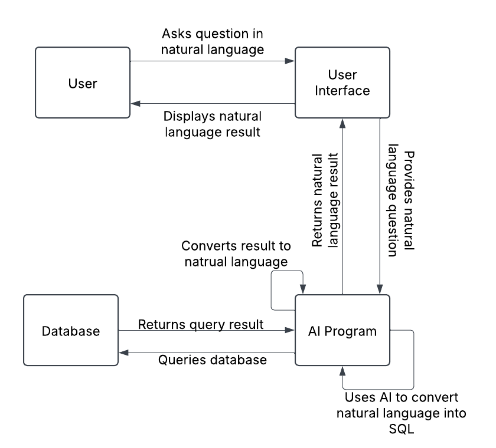

# AIGolfStats

## Project Initial Design

#### Initial Rough ERD

#### Initial System Design

#### Goals
- 3/19: Solidify design for both the database as well as the system interactions
- 3/26: Write program that uses AI to query the database
- 4/2: Begin work on UI, and populate database with data from the pga tour
- 4/9: Continue to work on the UI/ Integrate program into the application
- 4/16: Finish UI/program integration and deploy to the web
